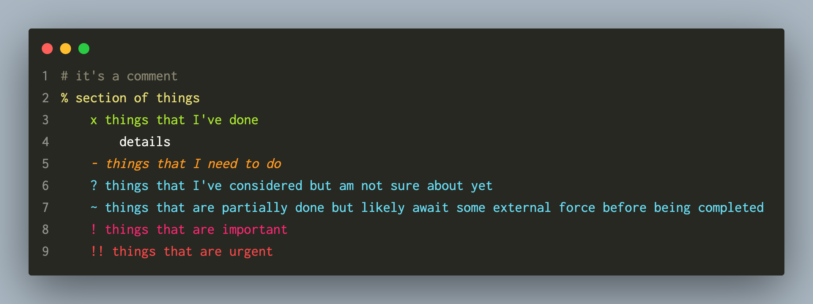

# note

note syntax by ciiqr



## Customize

The defaults work best with monokai, but can be customized for other themes in
`settings.json`

```json
"editor.tokenColorCustomizations": {
    "textMateRules": [
        // Note
        {
            // #
            "scope": "source.note comment",
            "settings": {
                "foreground": "#88846f"
            }
        },
        {
            // %
            "scope": "source.note string",
            "settings": {
                "foreground": "#E6DB74"
            }
        },
        {
            // x
            "scope": "source.note entity.name.function",
            "settings": {
                "foreground": "#A6E22E"
            }
        },
        {
            // -
            "scope": "source.note variable.parameter",
            "settings": {
                "foreground": "#FD971F",
                "fontStyle": ""
            }
        },
        {
            // ?
            "scope": "source.note support.function",
            "settings": {
                "foreground": "#66D9EF"
            }
        },
        {
            // ~
            "scope": "source.note support.constant",
            "settings": {
                "foreground": "#66D9EF"
            }
        },
        {
            // !
            "scope": "source.note keyword",
            "settings": {
                "foreground": "#F92672"
            }
        },
        {
            // !!
            "scope": "source.note invalid",
            "settings": {
                "foreground": "#F92672",
                "fontStyle": "bold underline"
            }
        }
    ]
}
```
